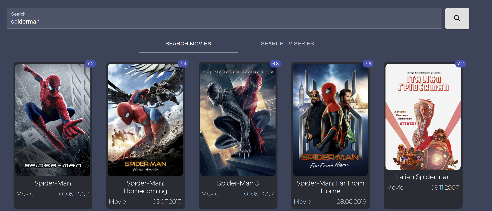
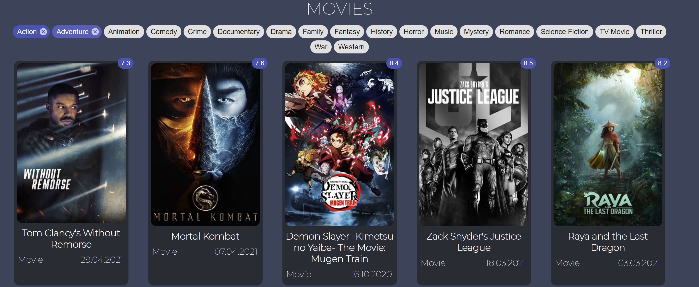
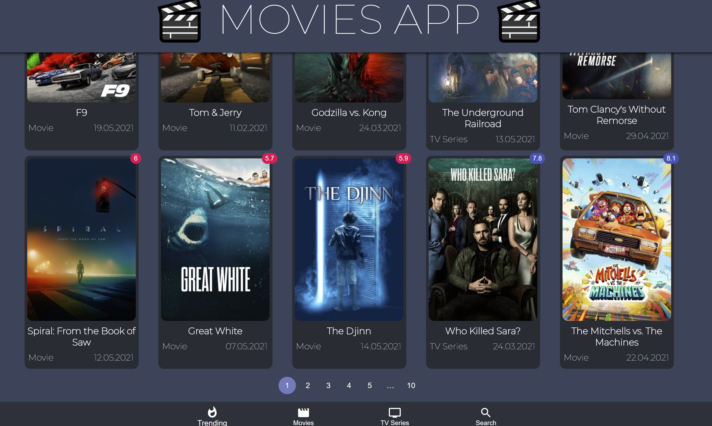
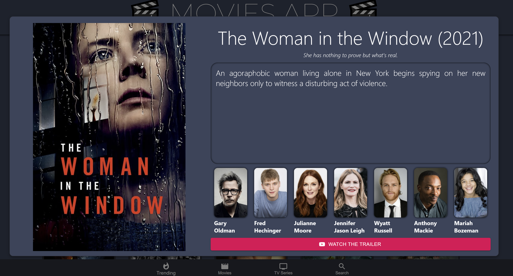

# Movies_App
***Simple movie app where you can find the hottest trending, movies and series, you can use advanced search by category/genre you like or you can click on the movie / series to get more details such as actors and even link to watch the trailer.***

## Instructions
##### 1. Clone ***( using `git clone` )*** or Download the folder ***( using ***`Download ZIP`*** option )*** #####
##### 2. Open your code editor and add the project folder #####
##### 3. Open the terminal and install all required dependencies with ***`npm i`*** #####
##### 4. type ***`npm start`*** to start the app #####

###### 🎥 *Enjoy using the app !* 🎥 ######

